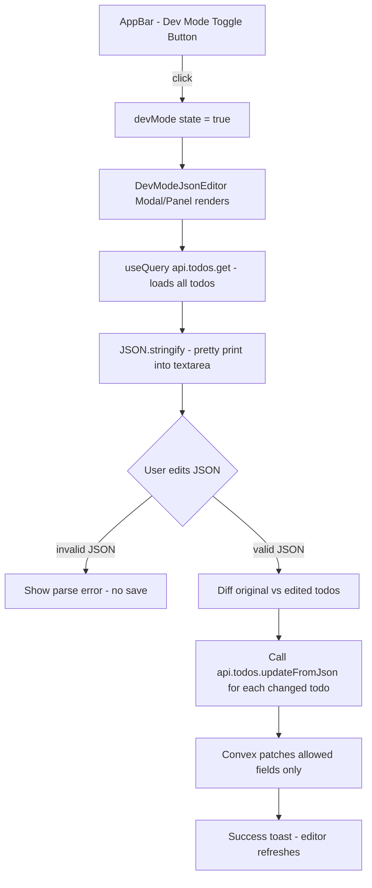

# Developer Mode JSON Editor — Implementation Plan

## Overview

Add a **Developer Mode** toggle to the app that opens a full-screen JSON editor panel. The panel displays all todos (including recurring details) as a raw JSON array. When the developer edits the JSON and it is valid, a single "Apply" action patches each changed todo directly in Convex DB.

---

## Architecture



---

## Data Model — Editable Fields

The JSON editor will expose **all user-editable fields** from the `todos` schema. System-managed fields (`_id`, `_creationTime`, `timerStarted`, `timerSessions`, `doneAt`, `completedAt`, `productivityScore`, `lastEditedBy`) will be shown as **read-only** (greyed out in the UI) and stripped before patching.

### Editable fields exposed in JSON
| Field | Type | Notes |
|---|---|---|
| `text` | string | Task title |
| `done` | boolean | Completion state |
| `deadline` | string \| null | ISO date YYYY-MM-DD |
| `dueTime` | string \| null | HH:MM |
| `priority` | "high"\|"medium"\|"low" | |
| `mainCategory` | string \| null | |
| `subcategory` | string \| null | |
| `activityType` | string \| null | |
| `category` | string \| null | Legacy |
| `notes` | string \| null | |
| `tags` | string[] \| null | |
| `estimatedMinutes` | number \| null | |
| `isRecurring` | boolean | |
| `recurringPattern` | "daily"\|"weekly"\|"monthly"\|"custom"\|null | |
| `recurringInterval` | number \| null | |
| `recurringDays` | number[] \| null | Days of week 0-6 |
| `countLabel` | string \| null | |
| `count` | number \| null | |
| `timeSpentMinutes` | number \| null | |
| `distance` | number \| null | |
| `distanceUnit` | string \| null | |
| `effortLevel` | "low"\|"medium"\|"deep_work"\|null | |
| `difficulty` | "easy"\|"medium"\|"hard"\|null | |
| `scheduledStart` | string \| null | |
| `scheduledEnd` | string \| null | |
| `timeBlockDate` | string \| null | |
| `lifeArea` | string \| null | |
| `isTop3` | boolean \| null | |
| `top3Date` | string \| null | |
| `top3Order` | number \| null | |
| `position` | number \| null | |
| `currentStreak` | number \| null | Recurring streak |
| `longestStreak` | number \| null | |
| `totalMissed` | number \| null | |
| `totalCompleted` | number \| null | |
| `lastCompletedDate` | string \| null | |

### Read-only fields (shown but not patchable)
`_id`, `_creationTime`, `timerStarted`, `timerSessions`, `doneAt`, `completedAt`, `parentRecurringId`, `parentId`, `subtasks`, `dependencies`

---

## Implementation Steps

### Step 1 — Convex Backend: `updateFromJson` mutation

**File:** [`convex/todos.ts`](../convex/todos.ts)

Add a new mutation `updateFromJson` that:
1. Accepts `id: v.id("todos")` and a `fields` object containing any subset of editable fields
2. Strips any system/read-only keys before patching
3. Calls `ctx.db.patch(id, sanitizedFields)`
4. Sets `updatedAt: Date.now()` automatically

```typescript
export const updateFromJson = mutation({
  args: {
    id: v.id("todos"),
    fields: v.any(), // validated/sanitized in handler
  },
  handler: async (ctx, args) => {
    const EDITABLE_FIELDS = [
      'text', 'done', 'deadline', 'dueTime', 'priority',
      'mainCategory', 'subcategory', 'activityType', 'category',
      'notes', 'tags', 'estimatedMinutes', 'isRecurring',
      'recurringPattern', 'recurringInterval', 'recurringDays',
      'countLabel', 'count', 'timeSpentMinutes', 'distance', 'distanceUnit',
      'effortLevel', 'difficulty', 'scheduledStart', 'scheduledEnd',
      'timeBlockDate', 'lifeArea', 'isTop3', 'top3Date', 'top3Order',
      'position', 'currentStreak', 'longestStreak', 'totalMissed',
      'totalCompleted', 'lastCompletedDate',
    ];
    const patch: any = { updatedAt: Date.now() };
    for (const key of EDITABLE_FIELDS) {
      if (key in args.fields) patch[key] = args.fields[key];
    }
    if (patch.done !== undefined) {
      patch.doneAt = patch.done ? Date.now() : undefined;
    }
    await ctx.db.patch(args.id, patch);
  },
});
```

---

### Step 2 — New Component: `DevModeJsonEditor.jsx`

**File:** [`src/components/DevModeJsonEditor.jsx`](../src/components/DevModeJsonEditor.jsx)

#### UI Layout
```
┌─────────────────────────────────────────────────────────────┐
│  🛠 Developer Mode — JSON Editor                    [Close X] │
├─────────────────────────────────────────────────────────────┤
│  ⚠ Warning banner: "Direct DB edits. Use with caution."     │
│                                                             │
│  [Filter: all | active | recurring]  [Search by text...]   │
│                                                             │
│  ┌───────────────────────────────────────────────────────┐  │
│  │  {                                                    │  │
│  │    "_id": "abc123",          ← greyed, non-editable   │  │
│  │    "text": "Run 5km",        ← white, editable        │  │
│  │    "isRecurring": true,                               │  │
│  │    "recurringPattern": "daily",                       │  │
│  │    ...                                                │  │
│  │  }                                                    │  │
│  └───────────────────────────────────────────────────────┘  │
│                                                             │
│  ✅ JSON is valid  |  3 todos changed                       │
│                                                             │
│  [Reset to Original]              [Apply Changes to DB]     │
└─────────────────────────────────────────────────────────────┘
```

#### Component Logic

```jsx
// Key state
const [jsonText, setJsonText] = useState('');
const [parseError, setParseError] = useState(null);
const [changedCount, setChangedCount] = useState(0);
const [saving, setSaving] = useState(false);
const [filter, setFilter] = useState('all'); // all | active | recurring
const [search, setSearch] = useState('');

// On open: serialize todos to JSON (filtered)
// On change: parse + diff against original
// On apply: call updateFromJson for each changed todo
```

#### Key behaviours
- **Real-time validation**: parse JSON on every keystroke; show green ✅ or red ❌ with error message + line number
- **Diff detection**: compare parsed JSON array against original snapshot; only patch todos whose fields actually changed (by `_id`)
- **Read-only field highlighting**: system fields shown in a muted colour in the editor (achieved via a comment strip or a side-by-side readonly panel)
- **Filter/search**: reduce the JSON to only matching todos so the editor isn't overwhelming
- **Reset**: restore textarea to the original fetched JSON
- **Apply**: iterate changed todos, call `updateFromJson` for each, show success/error toast per item
- **Keyboard shortcut**: `Ctrl+S` / `Cmd+S` triggers Apply when JSON is valid

---

### Step 3 — App.jsx Integration

**File:** [`src/App.jsx`](../src/App.jsx)

#### Changes
1. Add `devMode` state: `const [devMode, setDevMode] = useState(false)`
2. Import `DevModeJsonEditor` and `Code` icon from MUI icons
3. Add **Dev Mode** `IconButton` to AppBar (desktop) and mobile drawer menu
4. Render `<DevModeJsonEditor open={devMode} onClose={() => setDevMode(false)} />` as a full-screen `Dialog` or slide-in `Drawer`

#### AppBar button (desktop)
```jsx
<IconButton
  color="inherit"
  onClick={() => setDevMode(true)}
  title="Developer Mode — JSON Editor"
  aria-label="developer mode"
>
  <Code />  {/* or DataObject icon */}
</IconButton>
```

#### Mobile drawer entry
Add a `ListItem` in the existing mobile `Drawer` menu:
```jsx
<ListItem button onClick={() => { setDevMode(true); setMobileMenuOpen(false); }}>
  <ListItemIcon><Code /></ListItemIcon>
  <ListItemText primary="Dev Mode (JSON)" />
</ListItem>
```

---

## Component File Structure

```
src/
  components/
    DevModeJsonEditor.jsx   ← NEW
convex/
  todos.ts                  ← ADD updateFromJson mutation
src/
  App.jsx                   ← ADD devMode state + toggle + render
```

---

## UX Decisions

| Decision | Choice | Reason |
|---|---|---|
| Editor type | Plain `<textarea>` with monospace font | No extra deps; works well for JSON |
| Modal type | MUI `Dialog` fullScreen on mobile, large on desktop | Consistent with existing MUI usage |
| Validation timing | On every keystroke (debounced 300ms) | Immediate feedback without lag |
| Apply scope | Only changed todos (diff by `_id`) | Avoids unnecessary DB writes |
| Read-only fields | Shown in JSON but stripped server-side | Transparency without risk |
| Warning | Prominent amber banner | Prevents accidental misuse |
| Persistence | No local storage; always fresh from DB | Avoids stale state issues |

---

## No New Dependencies Required

- Uses existing MUI components (`Dialog`, `TextField`, `Button`, `Chip`, `Alert`)
- Uses existing Convex `useMutation` / `useQuery` hooks
- Plain `textarea` for JSON editing (no CodeMirror/Monaco needed for MVP)

---

## Future Enhancements (out of scope for now)
- Syntax-highlighted editor (Monaco/CodeMirror)
- Per-field inline validation with schema hints
- Import/export JSON to file
- Undo history within the editor session
