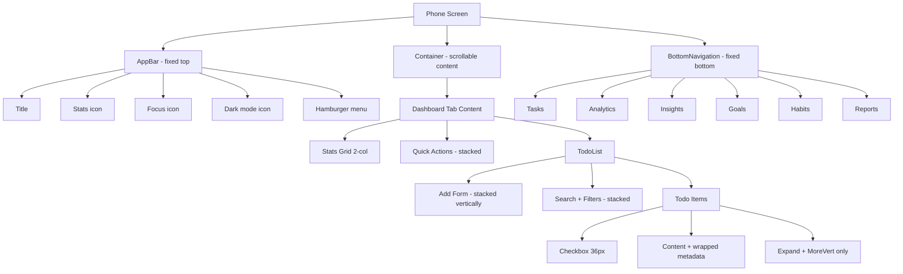

# Mobile UI Improvements Plan

## Problem Summary

The app has some mobile CSS in place but several critical UX issues remain on phones:

1. **Add-todo form row** — all inputs (`todo-input`, `date-input`, `priority-select`, `add-button`) sit in a single `flex` row with no wrapping, causing horizontal overflow on narrow screens.
2. **Controls bar** — search + two `<select>` dropdowns in one flex row overflow on small phones.
3. **TodoItem metadata row** — deadline, timer status, time estimates, and indicator chips all sit in one `Box` with `gap: 2` and no wrapping, causing overflow.
4. **TodoItem action buttons** — drag handle + expand + MoreVert are all visible at once, eating into the content area on narrow screens.
5. **Navigation tabs** — scrollable tabs at the top are small and hard to tap; no bottom nav bar for thumb-friendly navigation.
6. **App.jsx quick-action buttons** — already `fullWidth` on mobile but stacked vertically, which is fine, but they have no minimum height enforced consistently.
7. **Stats grid** — 2-col grid works but on very small phones (320px) numbers overflow their cells.
8. **Global CSS** — `button` min-height 48px rule conflicts with small icon buttons inside todo items, making them oversized.

---

## Files to Change

| File | What Changes |
|------|-------------|
| [`src/components/TodoList.jsx`](src/components/TodoList.jsx) | Responsive form layout, controls stacking, mobile CSS inside `<style>` block |
| [`src/components/TodoItem.jsx`](src/components/TodoItem.jsx) | Metadata row wrapping, action button tap targets, mobile-aware layout |
| [`src/App.jsx`](src/App.jsx) | Replace top scrollable tabs with bottom navigation bar on mobile; keep tabs on desktop |
| [`src/index.css`](src/index.css) | Scope the 48px min-height rule to exclude `.todo-actions` buttons; add safe-area insets for notched phones |

---

## Detailed Changes

### 1. [`src/components/TodoList.jsx`](src/components/TodoList.jsx) — Add-form & Controls

**Add-form (`form-row`):**
- Change `.form-row` to `flex-wrap: wrap` so inputs wrap naturally.
- Give `.todo-input` `flex: 1 1 100%` on mobile so it takes the full width.
- Give `.date-input` and `.priority-select` `flex: 1 1 auto` so they sit side-by-side on the second line.
- Give `.add-button` `width: 100%` on mobile so it spans the full row.
- Add `@media (max-width: 600px)` block inside the `<style>` tag.

**Controls bar (`.controls`):**
- Already has `flex-wrap: wrap` but `.filter-section` (two selects) doesn't wrap internally.
- Add `flex-direction: column` to `.controls` on mobile.
- Make `.filter-section` `flex-wrap: wrap` with each select `flex: 1 1 calc(50% - 4px)`.
- Make `.search-section` `min-width: unset; width: 100%`.

**Stats bar (`.stats`):**
- Already horizontal — just reduce `gap` to `8px` and `font-size` to `0.8rem` on mobile.

**Bulk actions (`.bulk-actions`):**
- Add `flex-wrap: wrap` so buttons wrap on small screens.

### 2. [`src/components/TodoItem.jsx`](src/components/TodoItem.jsx) — Metadata & Actions

**Metadata row:**
- Add `flexWrap: 'wrap'` to the `Box` at line 657 (the metadata row).
- Reduce `gap` from `2` to `1` on mobile using `useMediaQuery` or a responsive sx value.
- The deadline `Typography` should truncate with `noWrap` only on desktop; on mobile allow wrapping.

**Action buttons:**
- The drag handle (`DragIndicatorIcon`) is not useful on mobile (touch drag is already handled by dnd-kit). Hide it on mobile with `display: { xs: 'none', sm: 'flex' }`.
- Keep expand (`ExpandMore`) and `MoreVert` — these are the only two actions needed on mobile.
- Increase `IconButton` size from `"small"` to default on mobile for better tap targets.

**Checkbox:**
- Already 28px on mobile — increase to 36px for better tap target (update `.todo-checkbox` in `index.css`).

### 3. [`src/App.jsx`](src/App.jsx) — Bottom Navigation on Mobile

Replace the scrollable `<Tabs>` with a **bottom navigation bar** on mobile using MUI's `BottomNavigation` + `BottomNavigationAction` components.

```
Desktop: keep existing <Tabs> in the Paper at the top
Mobile:  hide the Paper/Tabs, show <BottomNavigation> fixed at bottom of screen
```

**Implementation:**
- Import `BottomNavigation`, `BottomNavigationAction`, `Paper` from MUI.
- Render `<BottomNavigation>` only when `isMobile`, fixed to bottom with `position: fixed; bottom: 0; left: 0; right: 0; z-index: 1000`.
- Add `pb: isMobile ? '56px' : 0` to the `<Container>` so content isn't hidden behind the nav bar.
- Show only 5 items max in bottom nav (Dashboard, Analytics, Goals, Habits, Reports — drop Insights or merge it).
- On desktop, keep the existing `<Tabs>` in the `<Paper>`.

**Bottom nav items (5 max for mobile):**

| Icon | Label | Tab index |
|------|-------|-----------|
| Home | Tasks | 0 |
| Analytics | Analytics | 1 |
| Psychology | Insights | 2 |
| EmojiEvents | Goals | 3 |
| Loop | Habits | 4 |
| Assessment | Reports | 5 |

Since MUI `BottomNavigation` supports up to ~5 items comfortably, show all 6 with a small font size, or drop one.

### 4. [`src/index.css`](src/index.css) — Scoped Touch Targets & Safe Area

**Problem:** The global rule `button { min-height: 48px !important }` makes small icon buttons inside todo items huge.

**Fix:** Scope the 48px rule to only top-level interactive elements:
```css
/* Only apply large touch targets to standalone buttons, not icon buttons inside items */
.add-button,
.action-button,
.MuiButton-root,
.MuiBottomNavigationAction-root {
  min-height: 48px !important;
}
```
Remove the blanket `button` selector from the touch-target rule.

**Safe area insets (notched phones):**
```css
@supports (padding-bottom: env(safe-area-inset-bottom)) {
  .MuiBottomNavigation-root {
    padding-bottom: env(safe-area-inset-bottom);
    height: calc(56px + env(safe-area-inset-bottom));
  }
  /* Push container content above bottom nav + safe area */
  .mobile-container-padding {
    padding-bottom: calc(56px + env(safe-area-inset-bottom));
  }
}
```

**Todo checkbox tap target:**
```css
@media (max-width: 768px) {
  .todo-checkbox {
    width: 36px !important;
    height: 36px !important;
    min-width: 36px !important;
    min-height: 36px !important;
  }
}
```

---

## Architecture Diagram



---

## Implementation Order

1. **[`src/index.css`](src/index.css)** — Fix global touch target rule, add safe-area insets, fix checkbox size. This is foundational and affects everything else.
2. **[`src/components/TodoList.jsx`](src/components/TodoList.jsx)** — Fix add-form and controls layout. This is the most-used screen.
3. **[`src/components/TodoItem.jsx`](src/components/TodoItem.jsx)** — Fix metadata wrapping and hide drag handle on mobile.
4. **[`src/App.jsx`](src/App.jsx)** — Add bottom navigation bar for mobile.
