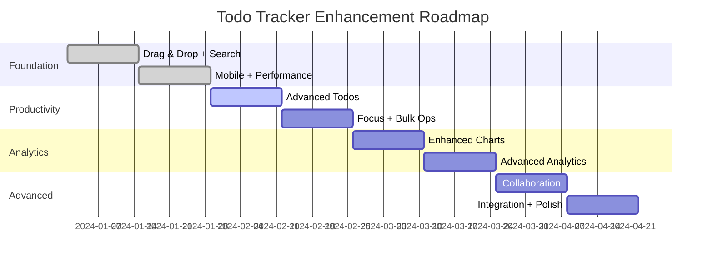

# Todo Tracker App: Practical Implementation Roadmap

## Executive Summary

This document provides a realistic, actionable implementation plan that restructures the comprehensive enhancement plan into achievable milestones. The roadmap reduces scope from 24 weeks to 16 weeks, focusing on high-impact features that can be developed and tested independently.

**Current State**: React-based todo tracker with custom activity sections, Material-UI, Convex backend
**Target**: Enhanced productivity platform with core features that provide immediate user value

---

## Current Architecture Analysis

### Technical Foundation
- **Frontend**: React 19, Material-UI v7, Recharts, @dnd-kit (disabled)
- **Backend**: Convex real-time database
- **Build**: Vite with modern tooling
- **State**: React hooks + Convex queries (simple but effective)

### Current Capabilities
- ✅ Basic todo management ([`todos`](convex/schema.ts:17))
- ✅ Custom activity tracking with flexible columns ([`sections`](convex/schema.ts:5))
- ✅ Data visualization (line charts)
- ✅ CSV export functionality
- ✅ Real-time sync via Convex
- ❌ Drag & drop (disabled but dependencies present)

### Key Limitations
- Simple todo schema (no priorities, categories, subtasks)
- Limited search/filtering
- No bulk operations
- Basic mobile experience
- No collaboration features

---

## Realistic Module Breakdown

### 🏗️ Foundation Module (Weeks 1-4)
**Focus**: Core improvements and infrastructure
**Goal**: Enhance existing features and fix fundamental UX issues

### 🚀 Productivity Module (Weeks 5-8)
**Focus**: Advanced todo management and time tracking
**Goal**: Transform basic todos into professional task management

### 📊 Analytics Module (Weeks 9-12)
**Focus**: Data insights and visualization
**Goal**: Provide actionable productivity insights

### 🤝 Advanced Module (Weeks 13-16)
**Focus**: Collaboration and integration
**Goal**: Enable team productivity and external tool integration

---

## Priority Matrix & Feature Analysis

### Foundation Module Features

| Feature | Impact | Complexity | Dependencies | Risk | Priority |
|---------|--------|------------|--------------|------|----------|
| **Restore Drag & Drop** | High | Low | @dnd-kit (present) | Low | P0 |
| **Enhanced Search/Filter** | High | Medium | Database indexing | Low | P0 |
| **Keyboard Shortcuts** | Medium | Low | None | Low | P1 |
| **Mobile Responsiveness** | High | Medium | UI refactoring | Medium | P0 |
| **Dark Mode** | Medium | Low | Theme system | Low | P1 |
| **Performance Optimization** | Medium | Medium | Code splitting | Low | P1 |

### Productivity Module Features

| Feature | Impact | Complexity | Dependencies | Risk | Priority |
|---------|--------|------------|--------------|------|----------|
| **Todo Priorities & Categories** | High | Medium | Schema migration | Medium | P0 |
| **Subtasks** | High | High | UI redesign | Medium | P1 |
| **Recurring Tasks** | Medium | High | Background jobs | High | P2 |
| **Time Tracking** | High | Medium | Timer implementation | Low | P0 |
| **Bulk Operations** | Medium | Medium | Selection system | Low | P1 |
| **Focus Mode/Pomodoro** | Medium | Low | Timer + UI | Low | P1 |

### Analytics Module Features

| Feature | Impact | Complexity | Dependencies | Risk | Priority |
|---------|--------|------------|--------------|------|----------|
| **Enhanced Charts** | High | Medium | Chart.js integration | Low | P0 |
| **Productivity Dashboard** | High | High | Data aggregation | Medium | P0 |
| **Habit Tracking** | Medium | Medium | New data models | Medium | P1 |
| **Time Analytics** | High | High | Complex calculations | Medium | P1 |
| **Export Improvements** | Low | Low | File generation | Low | P2 |

### Advanced Module Features

| Feature | Impact | Complexity | Dependencies | Risk | Priority |
|---------|--------|------------|--------------|------|----------|
| **Basic Collaboration** | High | High | User auth system | High | P0 |
| **Comments System** | Medium | Medium | Real-time messaging | Medium | P1 |
| **Calendar Integration** | High | High | External APIs | High | P1 |
| **Template System** | Medium | Medium | Data modeling | Low | P1 |
| **Basic API** | Low | Medium | API framework | Medium | P2 |

---

## Quick Wins (1-2 Week Features)

### Week 1-2 Quick Wins
1. **Restore Drag & Drop** - Dependencies already present, just needs activation
2. **Basic Search** - Add simple text filtering to existing components
3. **Keyboard Shortcuts** - Implement common shortcuts (Ctrl+N, Enter, Escape)
4. **Dark Mode Toggle** - Extend existing Material-UI theme
5. **Mobile Touch Improvements** - Enhance existing responsive design

### Immediate Value Features
- **Todo Priorities** - Add priority field to schema and color-coded UI
- **Basic Categories** - Simple tagging system for organization
- **Completion Animations** - Visual feedback for task completion
- **Improved CSV Export** - Better formatting and more data fields

---

## Module Implementation Plans

### 🏗️ Foundation Module (Weeks 1-4)

#### Week 1-2: Core UX Fixes
**Sprint Goal**: Fix fundamental usability issues

**Features**:
- ✅ Restore drag & drop functionality
- ✅ Implement basic search and filtering
- ✅ Add essential keyboard shortcuts
- ✅ Dark mode implementation

**Success Criteria**:
- Users can reorder todos via drag & drop
- Search finds todos by text content
- Keyboard shortcuts work for common actions
- Dark mode toggles properly

**Technical Requirements**:
- Activate existing @dnd-kit integration
- Add search state management
- Implement hotkey handlers
- Extend Material-UI theme

#### Week 3-4: Mobile & Performance
**Sprint Goal**: Optimize for mobile and performance

**Features**:
- ✅ Mobile-responsive improvements
- ✅ Touch gesture optimization
- ✅ Performance optimization (code splitting)
- ✅ Loading states and error handling

**Success Criteria**:
- App works smoothly on mobile devices
- Touch interactions feel native
- Initial load time < 3 seconds
- Graceful error handling

**Technical Requirements**:
- Responsive design improvements
- Touch event handlers
- React.lazy() for code splitting
- Error boundaries

### 🚀 Productivity Module (Weeks 5-8)

#### Week 5-6: Advanced Todo Management
**Sprint Goal**: Transform basic todos into professional tasks

**Features**:
- ✅ Priority levels (High, Medium, Low, Critical)
- ✅ Categories and tags with color coding
- ✅ Basic time tracking (start/stop timer)
- ✅ Due date improvements

**Success Criteria**:
- Users can assign priorities with visual indicators
- Categories help organize tasks effectively
- Time tracking provides accurate duration data
- Due dates show clear urgency indicators

**Technical Requirements**:
```typescript
// Enhanced Todo Schema
todos: {
  text: string,
  done: boolean,
  priority: "low" | "medium" | "high" | "critical",
  category: string,
  tags: string[],
  deadline: string,
  timeSpent: number,
  estimatedTime?: number,
  position: number,
  createdAt: number,
  updatedAt: number
}
```

#### Week 7-8: Productivity Features
**Sprint Goal**: Add focus and bulk operation capabilities

**Features**:
- ✅ Pomodoro timer with focus mode
- ✅ Bulk operations (select multiple, batch edit)
- ✅ Subtasks (basic implementation)
- ✅ Task templates

**Success Criteria**:
- Focus mode eliminates distractions
- Users can efficiently manage multiple tasks
- Subtasks break down complex work
- Templates speed up task creation

**Technical Requirements**:
- Timer state management
- Multi-select UI components
- Hierarchical task data structure
- Template storage system

### 📊 Analytics Module (Weeks 9-12)

#### Week 9-10: Enhanced Visualization
**Sprint Goal**: Provide actionable productivity insights

**Features**:
- ✅ Multiple chart types (bar, pie, heatmap)
- ✅ Productivity dashboard
- ✅ Completion rate analytics
- ✅ Time distribution analysis

**Success Criteria**:
- Charts clearly show productivity patterns
- Dashboard provides at-a-glance insights
- Users understand their productivity trends
- Data helps optimize work habits

**Technical Requirements**:
- Chart.js or D3.js integration
- Data aggregation functions
- Dashboard layout system
- Performance optimization for large datasets

#### Week 11-12: Advanced Analytics
**Sprint Goal**: Deliver predictive and habit insights

**Features**:
- ✅ Habit tracking integration
- ✅ Productivity scoring algorithm
- ✅ Goal setting and progress tracking
- ✅ Weekly/monthly reports

**Success Criteria**:
- Habit streaks motivate consistent behavior
- Productivity scores reflect actual performance
- Goals provide clear targets
- Reports summarize achievements

**Technical Requirements**:
- Habit data models
- Scoring algorithm implementation
- Goal tracking system
- Report generation

### 🤝 Advanced Module (Weeks 13-16)

#### Week 13-14: Collaboration Foundation
**Sprint Goal**: Enable basic team productivity

**Features**:
- ✅ User authentication system
- ✅ Shared workspaces (basic)
- ✅ Task assignment
- ✅ Activity feeds

**Success Criteria**:
- Users can create accounts and log in
- Teams can share workspace
- Tasks can be assigned to team members
- Activity feeds show team progress

**Technical Requirements**:
- Authentication provider integration
- Multi-user data models
- Permission system
- Real-time activity tracking

#### Week 15-16: Integration & Polish
**Sprint Goal**: Connect with external tools and polish features

**Features**:
- ✅ Calendar integration (basic)
- ✅ Email notifications
- ✅ Import/export improvements
- ✅ Template marketplace (basic)

**Success Criteria**:
- Calendar events sync with tasks
- Users receive relevant notifications
- Data can be migrated from other tools
- Templates can be shared

**Technical Requirements**:
- Calendar API integration
- Email service setup
- Data migration tools
- Template sharing system

---

## Resource Requirements

### Development Team
- **1 Senior Frontend Developer** (React, Material-UI, TypeScript)
- **1 Backend Developer** (Convex, API design, data modeling)
- **0.5 UX/UI Designer** (Design system, user research)
- **0.5 QA Engineer** (Testing, automation)

### New Dependencies

#### Foundation Module
```json
{
  "react-hotkeys-hook": "^4.4.0",
  "fuse.js": "^6.6.0",
  "react-window": "^1.8.0"
}
```

#### Productivity Module
```json
{
  "date-fns": "^2.29.0",
  "react-hook-form": "^7.43.0",
  "@hookform/resolvers": "^3.0.0"
}
```

#### Analytics Module
```json
{
  "chart.js": "^4.2.0",
  "react-chartjs-2": "^5.2.0",
  "date-fns": "^2.29.0"
}
```

#### Advanced Module
```json
{
  "@auth0/auth0-react": "^2.0.0",
  "react-query": "^3.39.0",
  "socket.io-client": "^4.6.0"
}
```

### Infrastructure Requirements
- **Authentication Service**: Auth0 or Firebase Auth
- **Email Service**: SendGrid or AWS SES
- **File Storage**: AWS S3 or Cloudinary
- **Monitoring**: Sentry for error tracking

---

## Testable Success Criteria

### Foundation Module Tests
```javascript
// Drag & Drop Tests
- Can reorder todos within list
- Can move todos between priority sections
- Visual feedback during drag operations
- Touch drag works on mobile

// Search Tests
- Finds todos by text content
- Filters by completion status
- Filters by priority level
- Search suggestions work

// Keyboard Shortcuts Tests
- Ctrl+N creates new todo
- Enter saves todo
- Escape cancels editing
- Tab navigates between elements
```

### Productivity Module Tests
```javascript
// Priority Tests
- Can assign priority levels
- Visual indicators show correctly
- Sorting by priority works
- Priority affects task ordering

// Time Tracking Tests
- Timer starts/stops accurately
- Time is recorded correctly
- Estimates vs actual comparison
- Pomodoro intervals work properly
```

### Analytics Module Tests
```javascript
// Dashboard Tests
- Charts render with correct data
- Date range filtering works
- Performance metrics calculate correctly
- Export functionality works

// Habit Tracking Tests
- Streaks calculate correctly
- Habit completion affects scores
- Visual progress indicators work
- Reminders trigger appropriately
```

### Advanced Module Tests
```javascript
// Collaboration Tests
- Users can join workspaces
- Task assignment notifications work
- Permission system enforces access
- Real-time updates sync properly

// Integration Tests
- Calendar events sync correctly
- Email notifications deliver
- Import preserves data integrity
- Export includes all relevant data
```

---

## Risk Mitigation Strategies

### Technical Risks

#### Database Migration Risk
**Risk**: Schema changes may cause data loss
**Mitigation**:
- Implement backward-compatible migrations
- Comprehensive backup before each migration
- Staged rollout with rollback capability

#### Performance Risk
**Risk**: New features may slow down the app
**Mitigation**:
- Performance budgets for each module
- Continuous monitoring with Lighthouse CI
- Code splitting and lazy loading
- Database query optimization

#### Complexity Risk
**Risk**: Feature additions may make app too complex
**Mitigation**:
- Progressive disclosure in UI design
- Feature flags for gradual rollout
- User testing at each milestone
- Simplified onboarding flow

### Business Risks

#### User Adoption Risk
**Risk**: Users may resist changes to familiar interface
**Mitigation**:
- Optional feature flags
- Comprehensive change communication
- Migration guides and tutorials
- Feedback collection and iteration

#### Scope Creep Risk
**Risk**: Additional feature requests during development
**Mitigation**:
- Strict module boundaries
- Change request process
- Regular stakeholder reviews
- Focus on core value proposition

---

## Success Metrics

### Foundation Module KPIs
- **User Engagement**: 25% increase in daily active users
- **Task Completion**: 15% improvement in completion rates
- **Mobile Usage**: 40% of sessions on mobile devices
- **Performance**: Page load time < 3 seconds

### Productivity Module KPIs
- **Feature Adoption**: 60% of users use priorities within 2 weeks
- **Time Tracking**: 40% of users track time on tasks
- **Efficiency**: 20% reduction in time to create tasks
- **User Satisfaction**: NPS score > 40

### Analytics Module KPIs
- **Dashboard Usage**: 70% of users view dashboard weekly
- **Goal Achievement**: 50% of users set and track goals
- **Insight Action**: 30% of users change behavior based on insights
- **Retention**: 80% 30-day retention rate

### Advanced Module KPIs
- **Collaboration**: 25% of users create shared workspaces
- **Integration Usage**: 40% of users connect external calendars
- **Template Adoption**: 50% of users use templates
- **Premium Conversion**: 15% freemium to premium conversion

---

## Implementation Timeline



---

## Next Steps

### Immediate Actions (Week 1)
1. **Set up development environment** with new dependencies
2. **Create feature branch** for Foundation Module
3. **Implement drag & drop restoration** (highest impact, lowest risk)
4. **Begin search functionality** development
5. **Set up testing framework** for continuous validation

### Stakeholder Communication
- **Weekly progress reviews** with stakeholders
- **Bi-weekly user testing** sessions
- **Monthly roadmap adjustments** based on feedback
- **Quarterly business metric reviews**

### Success Validation
- **A/B testing** for major UI changes
- **User feedback collection** at each milestone
- **Performance monitoring** throughout development
- **Business metric tracking** for ROI validation

---

## Conclusion

This practical implementation roadmap transforms the ambitious 24-week enhancement plan into a focused 16-week program that delivers immediate value while building toward advanced capabilities. The modular approach ensures each phase can be developed, tested, and deployed independently, reducing risk and enabling continuous user feedback.

**Key Success Factors**:
- ✅ **Realistic Scope**: Features sized for 2-week sprints
- ✅ **High Impact Focus**: Prioritizes user value over feature count
- ✅ **Technical Feasibility**: Builds on existing architecture
- ✅ **Testable Milestones**: Clear success criteria for each module
- ✅ **Risk Mitigation**: Comprehensive strategies for common pitfalls

This roadmap positions the todo tracker for sustainable growth while maintaining development velocity and user satisfaction.
