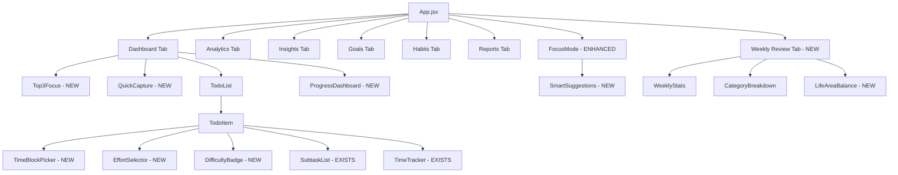

# PRD Implementation Plan — All Phases

## Codebase Audit Summary

### Already Implemented
| Feature | Status | Location |
|---------|--------|----------|
| Subtasks | ✅ Complete | `SubtaskList.jsx`, schema `parentId`/`subtasks` fields |
| Habit Streaks | ✅ Complete | `RecurringHabitTracker.jsx` with heatmap, streaks, completion rates |
| Focus Mode | ✅ Complete | `FocusMode.jsx` with Pomodoro/custom/stopwatch timers |
| Analytics Dashboard | ✅ Complete | `AnalyticsDashboard.jsx` with charts, category performance |
| Goal Tracker | ✅ Complete | `GoalTracker.jsx` with daily/weekly/monthly goals |
| Report Generator | ✅ Complete | `ReportGenerator.jsx` with CSV/JSON export |
| Productivity Insights | ✅ Complete | `ProductivityInsights.jsx` with mastery, lag detection |
| Time Tracking | ✅ Complete | `TimeTracker.jsx`, `estimatedMinutes`/`actualMinutes` on todos |
| Categories | ✅ Complete | Hierarchical: mainCategory → subcategory → activityType |
| Priority | ✅ Complete | high/medium/low with color coding |

### Needs to Be Built
| Feature | PRD Item | Phase |
|---------|----------|-------|
| Top 3 Daily Focus | 1️⃣ | Phase 1 |
| Time Blocking | 2️⃣ | Phase 2 |
| Weekly Review System | 4️⃣ | Phase 2 |
| Effort/Energy Level | 5️⃣ | Phase 2 |
| Smart Task Suggestions | 6️⃣ | Phase 3 |
| Progress Dashboard | 7️⃣ | Phase 3 |
| Quick Capture | 9️⃣ | Phase 3 |
| Task Difficulty | 🔟 | Phase 3 |
| Life Areas / Balance Score | Bonus | Phase 3 |

---

## Architecture Overview



---

## Phase 1 — Core Focus Features

### 1.1 Top 3 Daily Focus Tasks

**Goal:** Let users select up to 3 most important tasks for today, displayed prominently at the top of the Dashboard.

**Schema Changes** in `convex/schema.ts`:
```
todos table — add:
  isTop3: v.optional(v.boolean())        // Marked as a Top 3 task
  top3Date: v.optional(v.string())       // ISO date when it was set as Top 3
  top3Order: v.optional(v.number())      // 1, 2, or 3 ordering
```

**Backend Changes** in `convex/todos.ts`:
- New query: `getTop3Today` — returns todos where `isTop3 === true` and `top3Date === todayISO`
- New mutation: `setTop3` — accepts `{id, top3Order}`, validates max 3 per day, sets `isTop3`/`top3Date`/`top3Order`
- New mutation: `removeFromTop3` — clears `isTop3`/`top3Date`/`top3Order`
- New mutation: `clearTop3ForDate` — bulk clear for a given date

**Frontend — New Component:** `src/components/Top3Focus.jsx`
- Renders a prominent card at the top of Dashboard tab
- Shows "Today's Focus" header with date
- 3 numbered slots — filled tasks show text, priority chip, estimated time
- Empty slots show "Click to add" or drag-drop target
- Star icon on TodoItem to toggle Top 3 status
- Auto-clears previous day's Top 3 on load

**Integration Points:**
- `App.jsx` Dashboard tab: render `Top3Focus` above `TodoList`
- `TodoItem.jsx`: add ⭐ star icon to mark/unmark as Top 3
- `TodoList.jsx`: add filter option "Show Top 3 only"

### 1.2 Habit Streaks Enhancement

**Goal:** Enhance existing `RecurringHabitTracker.jsx` with more gamification.

**Schema Changes** — Already has `currentStreak`, `longestStreak`, `totalCompleted`, `totalMissed`. No schema changes needed.

**Frontend Enhancements** to `RecurringHabitTracker.jsx`:
- Add streak milestone badges: 🔥7 days, ⭐30 days, 💎100 days
- Add completion rate percentage per habit with color coding
- Add "streak at risk" warning when a habit is due today but not completed
- Add motivational messages based on streak length
- Sort habits by streak length or completion rate

### 1.3 Subtasks Polish

**Status:** Already fully implemented in `SubtaskList.jsx`.

**Minor Enhancements:**
- Add drag-to-reorder subtasks
- Add inline editing for subtask text
- Show subtask progress bar on parent TodoItem in collapsed view

---

## Phase 2 — Scheduling and Review

### 2.1 Weekly Review Dashboard

**Goal:** Dedicated tab for weekly reflection with stats, trends, and category breakdown.

**Backend Changes** in `convex/analytics.ts`:
- New query: `getWeeklyReviewData` — accepts `{weekStartDate}`, returns:
  - Tasks completed count
  - Tasks missed/overdue count
  - Focus score: `completed / (completed + missed) * 100`
  - Top categories completed with counts
  - Time spent breakdown
  - Comparison with previous week
  - Habit streak summaries

**Frontend — New Component:** `src/components/WeeklyReview.jsx`
- Week selector with prev/next navigation
- Summary cards: Tasks Completed, Tasks Missed, Focus Score %
- Category breakdown bar chart using `recharts`
- "Top Achievements" section highlighting best streaks, most productive day
- "Areas for Improvement" section showing missed habits, overdue tasks
- Week-over-week comparison arrows showing trends
- Optional: text area for personal weekly reflection notes

**Integration:**
- Add new tab in `App.jsx` tabs array: `{ label: 'Review', icon: <RateReview />, component: 'review' }`

### 2.2 Time Blocking

**Goal:** Allow users to attach scheduled time blocks to tasks, creating a visual daily timeline.

**Schema Changes** in `convex/schema.ts`:
```
todos table — add:
  scheduledStart: v.optional(v.string())   // ISO datetime or "HH:MM" for scheduled start
  scheduledEnd: v.optional(v.string())     // ISO datetime or "HH:MM" for scheduled end
  timeBlockDate: v.optional(v.string())    // ISO date for which day this block is scheduled
```

**Backend Changes** in `convex/todos.ts`:
- New mutation: `setTimeBlock` — accepts `{id, scheduledStart, scheduledEnd, timeBlockDate}`
- New mutation: `clearTimeBlock` — removes time block fields
- New query: `getTimeBlocksForDate` — returns todos with time blocks for a given date, sorted by `scheduledStart`

**Frontend — New Component:** `src/components/TimeBlockPicker.jsx`
- Inline time range picker: start time + end time dropdowns in 15-min increments
- Shows duration calculation
- Conflict detection: warns if overlapping with another time block

**Frontend — New Component:** `src/components/DailyTimeline.jsx`
- Visual vertical timeline showing the day from 6:00 to 23:00
- Time-blocked tasks rendered as colored blocks on the timeline
- Unscheduled tasks shown in a sidebar "Unscheduled" section
- Click on empty time slot to create a new task or assign existing one

**Integration:**
- `TodoItem.jsx`: add clock icon to open `TimeBlockPicker` inline
- Dashboard tab: optionally show `DailyTimeline` view toggle

### 2.3 Effort/Energy Level

**Goal:** Add effort tagging to tasks for smart filtering and suggestions.

**Schema Changes** in `convex/schema.ts`:
```
todos table — add:
  effortLevel: v.optional(v.union(
    v.literal('low'),
    v.literal('medium'),
    v.literal('deep_work')
  ))
```

Also add to `todoTemplates` table:
```
  effortLevel: v.optional(v.union(v.literal('low'), v.literal('medium'), v.literal('deep_work')))
```

**Backend Changes:**
- Update `todos.add` and `todos.update` mutations to accept `effortLevel`
- New query: `getTasksByEffort` — filter tasks by effort level

**Frontend — New Component:** `src/components/EffortSelector.jsx`
- 3-button toggle: ⚡ Low | ⚡⚡ Medium | ⚡⚡⚡ Deep Work
- Color coded: green, yellow, red/purple
- Compact chip display when not editing

**Integration:**
- `TodoItem.jsx`: show effort chip next to priority, add `EffortSelector` in expanded view
- `TodoList.jsx`: add effort level filter in filter bar
- `FocusMode.jsx`: use effort level in task suggestions

---

## Phase 3 — Intelligence and Polish

### 3.1 Smart Focus Suggestions

**Goal:** When entering Focus Mode, intelligently suggest the best task to work on now.

**No schema changes needed** — uses existing fields.

**Frontend — New Component:** `src/components/SmartSuggestions.jsx`
- Scoring algorithm considers:
  - Priority weight: high=3, medium=2, low=1
  - Deadline urgency: closer deadline = higher score
  - Effort match: if user selects "I have 20 min" → prefer low-effort tasks
  - Time of day: suggest deep work in morning, low effort in evening
  - Streak protection: prioritize habits at risk of breaking streak
  - Overdue penalty: overdue tasks get boosted score
- Shows top 3 suggested tasks with reasoning
- "Start this task" button launches Focus Mode with that task

**Integration:**
- `FocusMode.jsx`: replace random task picker with `SmartSuggestions`
- Dashboard: add "Suggested Next" card

### 3.2 Quick Capture

**Goal:** Natural language task entry that parses task name, time, priority, and category.

**No schema changes needed.**

**Frontend — New Component:** `src/components/QuickCapture.jsx`
- Single text input with parsing preview
- Parser logic in `src/utils/QuickCaptureParser.js`:
  - Detects priority: `p1`/`p2`/`p3` or `!high`/`!med`/`!low`
  - Detects date: `tomorrow`, `monday`, `next week`, `2024-03-15`
  - Detects time: `7am`, `14:00`, `at 3pm`
  - Detects effort: `#deep`, `#quick`, `#medium`
  - Detects category: `@fitness`, `@learning`, `@work`
  - Everything else = task name
- Live preview showing parsed fields below input
- Enter to confirm and create task

**Example:** `algorithms tomorrow 7am p1 @learning #deep`
→ Task: "algorithms", Deadline: tomorrow, Time: 07:00, Priority: high, Category: Learning, Effort: deep_work

**Integration:**
- Dashboard tab: render `QuickCapture` above `TodoList` as a prominent input bar
- Keyboard shortcut: `Q` to focus quick capture input

### 3.3 Task Difficulty

**Goal:** Tag tasks with difficulty and track completion stats.

**Schema Changes** in `convex/schema.ts`:
```
todos table — add:
  difficulty: v.optional(v.union(
    v.literal('easy'),
    v.literal('medium'),
    v.literal('hard')
  ))
```

**Backend Changes:**
- Update `todos.add` and `todos.update` to accept `difficulty`
- Add difficulty stats to analytics queries

**Frontend — New Component:** `src/components/DifficultyBadge.jsx`
- Visual badge: 🟢 Easy | 🟡 Medium | 🔴 Hard
- Inline selector in TodoItem expanded view

**Integration:**
- `TodoItem.jsx`: show difficulty badge
- `AnalyticsDashboard.jsx`: add "Hard tasks completed this week" stat card
- `WeeklyReview.jsx`: include difficulty breakdown

### 3.4 Life Areas / Balance Score

**Goal:** Categorize tasks into life areas and show a balance dashboard.

**Schema Changes** in `convex/schema.ts`:
```
New table: lifeAreas
  name: v.string()              // Career, Health, Learning, Relationships, Creativity
  icon: v.string()              // Emoji
  color: v.string()             // Hex color
  targetPercentage: v.number()  // Ideal % of time/tasks for this area
  isActive: v.boolean()
  createdAt: v.number()
```

```
todos table — add:
  lifeArea: v.optional(v.string())  // Links to life area name
```

**Backend Changes:**
- New file: `convex/lifeAreas.ts` with CRUD mutations and queries
- New query: `getLifeAreaBalance` — calculates actual vs target percentage per area
- Update `todos.add`/`todos.update` to accept `lifeArea`

**Frontend — New Component:** `src/components/LifeAreaBalance.jsx`
- Horizontal bar chart showing each life area's actual vs target percentage
- Color-coded bars: green if within 10% of target, yellow if 10-25% off, red if >25% off
- Overall "Balance Score" percentage
- Settings to configure life areas and target percentages

**Integration:**
- `WeeklyReview.jsx`: embed `LifeAreaBalance` component
- `TodoItem.jsx`: add life area selector in expanded view
- Dashboard: show balance score card

### 3.5 Progress Dashboard Enhancement

**Goal:** Visual "This Week" progress dashboard with graphs.

**No new schema needed** — uses existing analytics data.

**Frontend — New Component:** `src/components/WeeklyProgressDashboard.jsx`
- "This Week" summary cards: Tasks Completed, Deep Work Hours, Habits Maintained
- Daily completion bar chart for the current week
- Category pie chart
- Streak leaderboard for top habits
- Comparison with last week with trend arrows

**Integration:**
- Dashboard tab: render below `Top3Focus` and above `TodoList`
- Or as a collapsible section

---

## File Change Summary

### New Files to Create
| File | Purpose |
|------|---------|
| `src/components/Top3Focus.jsx` | Top 3 daily focus tasks UI |
| `src/components/QuickCapture.jsx` | Natural language task input |
| `src/utils/QuickCaptureParser.js` | NLP parsing logic for quick capture |
| `src/components/WeeklyReview.jsx` | Weekly review dashboard |
| `src/components/TimeBlockPicker.jsx` | Time block selector for tasks |
| `src/components/DailyTimeline.jsx` | Visual daily timeline view |
| `src/components/EffortSelector.jsx` | Effort level selector |
| `src/components/SmartSuggestions.jsx` | Intelligent task suggestions |
| `src/components/DifficultyBadge.jsx` | Task difficulty display/selector |
| `src/components/LifeAreaBalance.jsx` | Life area balance dashboard |
| `src/components/WeeklyProgressDashboard.jsx` | Visual weekly progress |
| `convex/lifeAreas.ts` | Life areas CRUD backend |

### Files to Modify
| File | Changes |
|------|---------|
| `convex/schema.ts` | Add fields: `isTop3`, `top3Date`, `top3Order`, `scheduledStart`, `scheduledEnd`, `timeBlockDate`, `effortLevel`, `difficulty`, `lifeArea`; add `lifeAreas` table |
| `convex/todos.ts` | Add mutations: `setTop3`, `removeFromTop3`, `getTop3Today`, `setTimeBlock`, `getTimeBlocksForDate`; update `add`/`update` for new fields |
| `convex/analytics.ts` | Add query: `getWeeklyReviewData`, `getLifeAreaBalance` |
| `src/App.jsx` | Add Weekly Review tab, integrate Top3Focus and QuickCapture into Dashboard |
| `src/components/TodoItem.jsx` | Add star icon for Top 3, effort chip, difficulty badge, time block display, life area selector |
| `src/components/TodoList.jsx` | Add effort/difficulty filters, integrate QuickCapture |
| `src/components/FocusMode.jsx` | Integrate SmartSuggestions instead of random picker |
| `src/components/RecurringHabitTracker.jsx` | Add streak badges, completion rate colors, streak-at-risk warnings |

---

## Implementation Order

```mermaid
gantt
    title PRD Feature Implementation
    dateFormat X
    axisFormat %s

    section Phase 1
    Schema changes for Top3 + Effort + Difficulty :p1s, 0, 1
    Top 3 Daily Focus backend :p1a, 0, 1
    Top 3 Daily Focus UI :p1b, after p1a, 1
    Habit Streaks Enhancement :p1c, after p1b, 1
    Subtasks Polish :p1d, after p1c, 1

    section Phase 2
    Schema changes for TimeBlock + LifeAreas :p2s, after p1d, 1
    Weekly Review backend :p2a, after p2s, 1
    Weekly Review UI :p2b, after p2a, 1
    Time Blocking backend :p2c, after p2b, 1
    Time Blocking UI :p2d, after p2c, 1
    Effort Level UI :p2e, after p2d, 1

    section Phase 3
    Smart Suggestions :p3a, after p2e, 1
    Quick Capture parser + UI :p3b, after p3a, 1
    Task Difficulty UI :p3c, after p3b, 1
    Life Areas backend + UI :p3d, after p3c, 1
    Progress Dashboard :p3e, after p3d, 1
    App.jsx integration + testing :p3f, after p3e, 1
```



---

## Recommended Execution Strategy

1. **Do all schema changes first** in a single `convex/schema.ts` update to avoid multiple deployments
2. **Build backend mutations/queries** for each feature before the UI
3. **Build UI components** in isolation, then integrate into `App.jsx`
4. **Test each phase** end-to-end before moving to the next

All new fields are `v.optional()` so they are backward-compatible with existing data.
