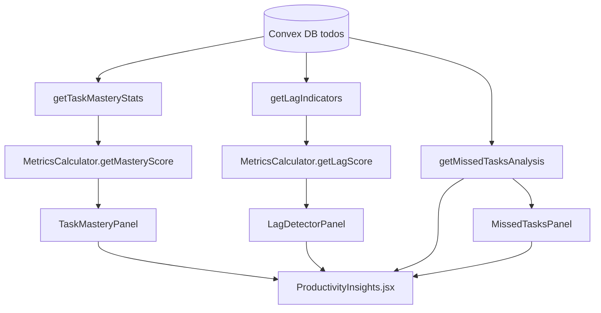

# Productivity Dashboard Enhancement Plan
## "Compulsive Insights" — Task Mastery, Lag Detection & Missed Tasks

---

## 1. Problem Statement

The current [`ProductivityInsights.jsx`](../src/components/ProductivityInsights.jsx) shows:
- A generic productivity score
- Current streak
- Time efficiency %
- Smart insights (text strings)
- Recommendations (text strings)
- Time patterns (peak hour/day)
- Priority analysis (counts)
- Category performance (completion rate + avg time)
- Efficiency trends (avg time, total time, efficiency %)

**What is missing / not compulsive enough:**
- No clear "where am I best?" — no ranked mastery view per category/task type
- No "where am I lagging?" — no lag score, no red-flag categories
- No "what did I miss?" — no overdue tasks, no skipped recurring tasks, no tasks never started
- No week-over-week or trend comparison per category
- No urgency/attention-grabbing visual hierarchy (everything looks the same)

---

## 2. Solution Overview

Add three new focused panels to `ProductivityInsights.jsx`:

| Panel | Purpose |
|---|---|
| **Task Mastery Panel** | Shows your top-performing categories/task types ranked by mastery score |
| **Lag Detector Panel** | Highlights categories/priorities where you are consistently behind |
| **Missed Tasks Panel** | Lists overdue tasks, skipped recurring tasks, and tasks never started |

These panels will be powered by three new Convex queries and new `MetricsCalculator` methods.

---

## 3. Data Flow Architecture



---

## 4. New Convex Queries — `convex/analytics.ts`

### 4.1 `getTaskMasteryStats`

**Purpose:** Returns per-category mastery data — completion rate, avg time, consistency, high-priority ratio.

**Args:** `period: optional string` (week/month/quarter)

**Returns per category:**
```ts
{
  category: string,
  total: number,
  completed: number,
  completionRate: number,       // 0-100
  avgTimeMinutes: number,
  highPriorityCompleted: number,
  highPriorityTotal: number,
  consistencyScore: number,     // % of days in period with at least 1 completion
  masteryScore: number,         // composite 0-100
  trend: 'improving' | 'stable' | 'declining'
}
```

**Mastery Score formula:**
```
masteryScore = (completionRate * 0.5) + (consistencyScore * 0.3) + (highPriorityRatio * 0.2)
```

**Trend:** Compare last half of period vs first half completion rate.

---

### 4.2 `getLagIndicators`

**Purpose:** Returns categories and priority buckets where the user is lagging — high pending count, low completion rate, overdue tasks.

**Args:** `period: optional string`

**Returns:**
```ts
{
  lagCategories: [{
    category: string,
    pendingCount: number,
    overdueCount: number,
    completionRate: number,
    lagScore: number,           // 0-100, higher = more lagging
    avgDaysOverdue: number,
    lastCompletedAt: string | null
  }],
  lagPriorities: [{
    priority: 'high' | 'medium' | 'low',
    pendingCount: number,
    overdueCount: number,
    completionRate: number
  }],
  overallLagScore: number       // 0-100
}
```

**Lag Score formula:**
```
lagScore = (overdueRatio * 0.4) + ((1 - completionRate/100) * 0.4) + (avgDaysOverdue/30 * 0.2)
```

---

### 4.3 `getMissedTasksAnalysis`

**Purpose:** Returns concrete lists of missed/skipped/never-started tasks.

**Returns:**
```ts
{
  overdueTasks: [{
    id: string,
    text: string,
    deadline: string,
    daysOverdue: number,
    priority: string,
    category: string
  }],
  neverStartedTasks: [{        // created > 7 days ago, not done, no timeSpent
    id: string,
    text: string,
    createdDaysAgo: number,
    priority: string,
    category: string
  }],
  skippedRecurring: [{         // recurring tasks not completed in their window
    id: string,
    text: string,
    recurringPattern: string,
    lastCompletedAt: string | null,
    daysSinceLastCompletion: number
  }],
  summary: {
    totalMissed: number,
    criticalMissed: number,    // high priority overdue
    recurringMissed: number
  }
}
```

---

## 5. New MetricsCalculator Methods — `src/utils/MetricsCalculator.js`

### 5.1 `calculateMasteryScore(categoryData)`
- Input: `{ completionRate, consistencyScore, highPriorityRatio }`
- Output: `number` (0-100)
- Formula: `(completionRate * 0.5) + (consistencyScore * 0.3) + (highPriorityRatio * 0.2)`

### 5.2 `calculateLagScore(categoryData)`
- Input: `{ overdueRatio, completionRate, avgDaysOverdue }`
- Output: `number` (0-100)
- Formula: `(overdueRatio * 0.4) + ((1 - completionRate/100) * 0.4) + (Math.min(avgDaysOverdue/30, 1) * 0.2)`

### 5.3 `getMasteryLabel(score)`
- Returns: `'Expert' | 'Proficient' | 'Developing' | 'Struggling'`
- Thresholds: ≥80 Expert, ≥60 Proficient, ≥40 Developing, <40 Struggling

### 5.4 `getLagLabel(score)`
- Returns: `'Critical' | 'Behind' | 'Slight Lag' | 'On Track'`
- Thresholds: ≥70 Critical, ≥50 Behind, ≥30 Slight Lag, <30 On Track

---

## 6. New React Components

### 6.1 `TaskMasteryPanel.jsx`

**Location:** `src/components/TaskMasteryPanel.jsx`

**Visual design:**
- Ranked list of categories sorted by `masteryScore` descending
- Each row: category name | mastery label chip | progress bar (masteryScore) | completion rate | trend arrow
- Top 3 get a gold/silver/bronze badge
- Color coding: Expert=green, Proficient=blue, Developing=orange, Struggling=red
- Collapsible — shows top 5 by default, "Show all" expands

**Key MUI components:** `List`, `LinearProgress`, `Chip`, `Avatar` (for rank badge), `TrendingUp`/`TrendingDown` icons

---

### 6.2 `LagDetectorPanel.jsx`

**Location:** `src/components/LagDetectorPanel.jsx`

**Visual design:**
- Alert-style header showing `overallLagScore` with color (green/yellow/orange/red)
- Two sub-sections:
  1. **Lagging Categories** — sorted by lagScore desc, each row shows: category | lag label chip | overdue count badge | days since last completion
  2. **Priority Lag** — 3 cards (High/Medium/Low) showing pending vs overdue counts
- "Critical" items pulse/highlight in red
- Empty state: "You're on track! No significant lag detected 🎉"

**Key MUI components:** `Alert`, `Badge`, `Card`, `Chip`, `WarningAmber`, `ErrorOutline` icons

---

### 6.3 `MissedTasksPanel.jsx`

**Location:** `src/components/MissedTasksPanel.jsx`

**Visual design:**
- Three tabbed sections: "Overdue" | "Never Started" | "Skipped Recurring"
- Each tab shows count badge
- **Overdue tab:** Sorted by daysOverdue desc, each item shows task text, deadline, days overdue badge, priority chip, category
- **Never Started tab:** Sorted by createdDaysAgo desc, shows task text, "created X days ago", priority, category
- **Skipped Recurring tab:** Shows recurring task, pattern, days since last completion
- Each item has a quick-action button: "Mark Done" or "Snooze" (future)
- Summary bar at top: "X overdue · Y never started · Z recurring missed"

**Key MUI components:** `Tabs`, `Tab`, `List`, `ListItem`, `Chip`, `Badge`, `AccessTime`, `RepeatOff` icons

---

## 7. Integration into `ProductivityInsights.jsx`

### New section layout (after existing Quick Stats):

```
[Quick Stats Row — existing]

[NEW: Missed Tasks Panel — full width, always visible, attention-grabbing]

[NEW: Task Mastery Panel — left half] | [NEW: Lag Detector Panel — right half]

[Existing: Smart Insights | Recommendations]

[Existing: Detailed Analysis accordion]
```

### New queries to add at top of `ProductivityInsights.jsx`:
```js
const masteryStats = useQuery(api.analytics.getTaskMasteryStats, { period: 'month' });
const lagIndicators = useQuery(api.analytics.getLagIndicators, { period: 'month' });
const missedAnalysis = useQuery(api.analytics.getMissedTasksAnalysis);
```

---

## 8. Visual Hierarchy & UX Principles

- **Missed Tasks Panel** is placed first after stats — it's the most urgent, attention-grabbing section
- **Lag Detector** uses red/orange colors and warning icons to create urgency
- **Task Mastery** uses positive reinforcement colors (green/gold) to reward good habits
- All three panels have empty states that are encouraging, not alarming
- Period selector (week/month/quarter) at the top of the page controls all three panels

---

## 9. Implementation Order

1. **`convex/analytics.ts`** — Add 3 new queries (`getTaskMasteryStats`, `getLagIndicators`, `getMissedTasksAnalysis`)
2. **`src/utils/MetricsCalculator.js`** — Add 4 new static methods
3. **`src/components/TaskMasteryPanel.jsx`** — New component
4. **`src/components/LagDetectorPanel.jsx`** — New component
5. **`src/components/MissedTasksPanel.jsx`** — New component
6. **`src/components/ProductivityInsights.jsx`** — Import and integrate the 3 new panels + new queries

---

## 10. Files to Create/Modify

| File | Action |
|---|---|
| [`convex/analytics.ts`](../convex/analytics.ts) | Modify — add 3 new queries |
| [`src/utils/MetricsCalculator.js`](../src/utils/MetricsCalculator.js) | Modify — add 4 new static methods |
| [`src/components/TaskMasteryPanel.jsx`](../src/components/TaskMasteryPanel.jsx) | Create new |
| [`src/components/LagDetectorPanel.jsx`](../src/components/LagDetectorPanel.jsx) | Create new |
| [`src/components/MissedTasksPanel.jsx`](../src/components/MissedTasksPanel.jsx) | Create new |
| [`src/components/ProductivityInsights.jsx`](../src/components/ProductivityInsights.jsx) | Modify — integrate panels |
