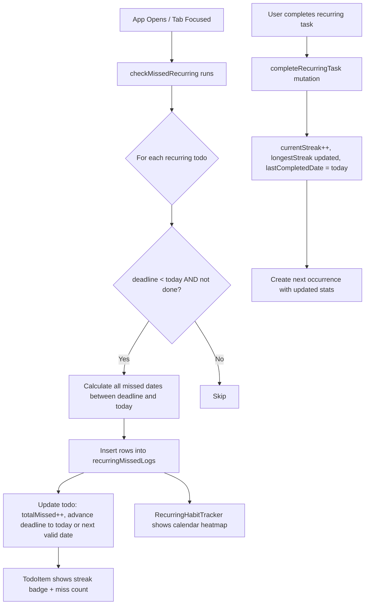
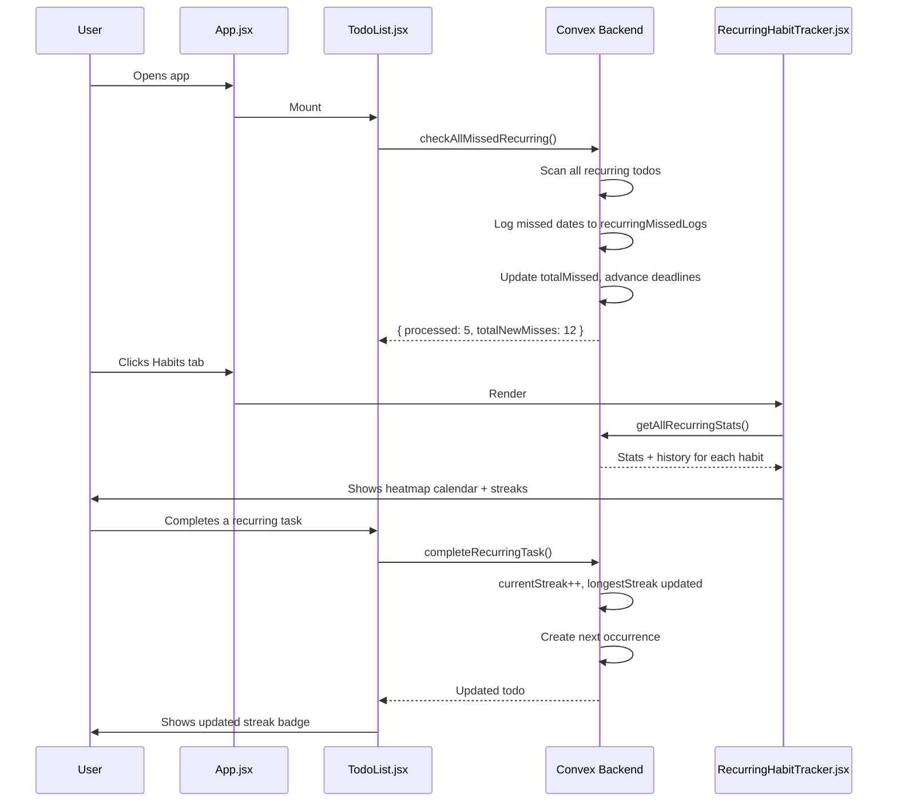

# Recurring Task Miss Tracking — Implementation Plan

## Problem Statement

The current recurring task system only creates the next occurrence **when you complete** the current one. If a deadline passes without completion, nothing happens:

- No "missed" record is created
- No backfill of skipped days/weeks
- No streak counter (consecutive completions)
- No miss counter (how many times skipped)
- No UI to review your habit compliance history

The user only sees the task sitting there with a stale deadline — they have no visibility into how many times they've missed it or what their completion rate is.

---

## Architecture Overview



---

## Data Model Changes

### 1. New table: `recurringMissedLogs`

Stores one row per missed occurrence of a recurring task.

```ts
recurringMissedLogs: defineTable({
  recurringRootId: v.id("todos"),   // The original/root recurring task ID
  missedDate: v.string(),           // ISO date "YYYY-MM-DD" that was missed
  pattern: v.string(),              // "daily" | "weekly" | "monthly" | "custom"
  taskText: v.string(),             // Snapshot of task text at time of miss
  loggedAt: v.number(),             // Timestamp when this miss was detected
})
  .index("by_root", ["recurringRootId"])
  .index("by_date", ["missedDate"])
```

### 2. New fields on `todos` table

Added to the existing `todos` schema definition:

| Field | Type | Description |
|---|---|---|
| `currentStreak` | `number` | Consecutive completions without a miss |
| `longestStreak` | `number` | All-time best streak |
| `totalMissed` | `number` | Lifetime miss count |
| `totalCompleted` | `number` | Lifetime completion count |
| `lastCompletedDate` | `string` | ISO date of last completion |
| `recurringStartDate` | `string` | ISO date when recurring was first set up (for history calculation) |

These fields live on the **root** recurring todo (the original one, identified by having no `parentRecurringId`). Child instances inherit the root's stats.

---

## Backend Changes

### File: `convex/schema.ts`

1. Add `recurringMissedLogs` table definition (see above).
2. Add new optional fields to `todos` table definition.

### File: `convex/recurringMissed.ts` (new file)

#### `detectAndLogMissed` mutation

```
Input: { todoId }
Logic:
  1. Load the todo
  2. If not isRecurring or done → skip
  3. Determine the "root" recurring ID (parentRecurringId ?? _id)
  4. Get the deadline date
  5. If deadline >= today → nothing missed yet
  6. Calculate all dates between deadline and yesterday (inclusive) that match the recurrence pattern
  7. For each such date, check if a log already exists in recurringMissedLogs (avoid duplicates)
  8. Insert missing log rows
  9. Update todo: totalMissed += newMissCount, advance deadline to next valid future date
Output: { missedCount, newDeadline }
```

#### `checkAllMissedRecurring` mutation

```
Input: {}
Logic:
  1. Query all todos where isRecurring = true AND done = false
  2. For each, call detectAndLogMissed logic inline
Output: { processed, totalNewMisses }
```

#### `getMissedLogs` query

```
Input: { recurringRootId?, startDate?, endDate?, limit? }
Output: Array of recurringMissedLog rows, sorted by missedDate desc
```

#### `getRecurringStats` query

```
Input: { recurringRootId }
Output: {
  currentStreak,
  longestStreak,
  totalMissed,
  totalCompleted,
  completionRate,   // totalCompleted / (totalCompleted + totalMissed)
  lastCompletedDate,
  recentHistory: Array<{ date, status: "completed" | "missed" }>  // last 30 days
}
```

#### `getAllRecurringStats` query

```
Input: {}
Output: Array of stats objects for all root recurring tasks, sorted by compliance rate asc (worst first)
```

### File: `convex/todos.ts`

#### Update `completeRecurringTask` mutation

When a recurring task is completed:
1. Increment `totalCompleted` on the root todo
2. Recalculate `currentStreak`:
   - If `lastCompletedDate` was yesterday (or the previous valid recurrence date) → `currentStreak + 1`
   - Otherwise → reset to `1` (streak broken)
3. Update `longestStreak = max(longestStreak, currentStreak)`
4. Set `lastCompletedDate = today`
5. Propagate these stats to the newly created next-occurrence todo

#### Update `calculateNextDueDate` helper

Add a new exported helper `calculateAllMissedDates(todo, upToDate)`:
```
Returns an array of ISO date strings for every occurrence that should have happened
between todo.deadline and upToDate (exclusive), matching the recurrence pattern.
```

---

## Frontend Changes

### File: `src/components/TodoItem.jsx`

On recurring tasks, show inline badges:
- 🔥 **Streak badge**: `currentStreak` days (green if > 0, grey if 0)
- ❌ **Miss badge**: `totalMissed` misses (red if > 0)
- **Compliance chip**: `completionRate%` (color-coded: green ≥ 80%, yellow 50–79%, red < 50%)

These appear in the expanded view of a recurring todo item.

### File: `src/components/RecurringHabitTracker.jsx` (new file)

A full-page "Habits" dashboard with:

#### Summary Cards Row
- Total active recurring habits
- Best streak (across all habits)
- Worst compliance rate habit (needs attention)
- Total misses this week

#### Per-Habit Cards
Each card shows:
- Task name + recurrence pattern label
- 🔥 Current streak / 🏆 Best streak
- Completion rate progress bar (color-coded)
- Mini calendar heatmap (last 30 days): green = completed, red = missed, grey = future/not applicable
- Total completed / Total missed counts

#### Calendar Heatmap Component
A 7-column grid (Mon–Sun) showing the last 5 weeks:
- Each cell = one day
- Color: green (completed), red (missed), grey (no occurrence), white (future)
- Tooltip on hover: date + status

#### Missed History List
Expandable section per habit showing all missed dates in reverse chronological order.

### File: `src/App.jsx`

Add a new **"Habits"** tab (with a `Loop` or `Repeat` MUI icon) between "Goals" and "Reports".

The tab renders `<RecurringHabitTracker />`.

### File: `src/components/TodoList.jsx`

On component mount (via `useEffect`), call the `checkAllMissedRecurring` mutation once per session (throttled with `localStorage` timestamp — max once per hour) to detect and log any missed recurring tasks since the last app open.

```js
useEffect(() => {
  const lastCheck = localStorage.getItem('lastMissedCheck');
  const oneHourAgo = Date.now() - 60 * 60 * 1000;
  if (!lastCheck || parseInt(lastCheck) < oneHourAgo) {
    checkAllMissedRecurring();
    localStorage.setItem('lastMissedCheck', Date.now().toString());
  }
}, []);
```

---

## Missed Date Calculation Logic

The key algorithm for `calculateAllMissedDates`:

```
function calculateAllMissedDates(todo, upToDate = today):
  dates = []
  cursor = new Date(todo.deadline)

  while cursor < upToDate:
    if matchesPattern(cursor, todo):
      dates.push(cursor.toISOString().split('T')[0])
    advanceCursor(cursor, todo.recurringPattern, todo.recurringInterval, todo.recurringDays)

  return dates
```

Pattern matching:
- **daily**: every day matches
- **weekly with recurringDays**: only days in `recurringDays` array match
- **weekly without recurringDays**: same day of week as original deadline
- **monthly**: same day of month as original deadline
- **custom**: every `recurringInterval` days from the start date

---

## UI Flow Diagram



---

## Implementation Order

1. **Schema** — Add `recurringMissedLogs` table + new `todos` fields (`convex/schema.ts`)
2. **Backend logic** — Create `convex/recurringMissed.ts` with all queries/mutations
3. **Update completeRecurringTask** — Add streak tracking to `convex/todos.ts`
4. **TodoList mount check** — Add `checkAllMissedRecurring` call on app open (`src/components/TodoList.jsx`)
5. **TodoItem badges** — Show streak/miss inline on recurring items (`src/components/TodoItem.jsx`)
6. **RecurringHabitTracker** — Build the full Habits dashboard (`src/components/RecurringHabitTracker.jsx`)
7. **App navigation** — Add Habits tab (`src/App.jsx`)

---

## Key Design Decisions

| Decision | Rationale |
|---|---|
| Store misses in a separate table | Keeps `todos` table clean; allows querying history without loading all todos |
| Detect misses on app open (client-triggered) | Convex free tier has no scheduled functions; client trigger is reliable enough |
| Throttle to once per hour | Prevents hammering the DB on every re-render |
| Stats live on root recurring todo | Single source of truth; child instances inherit |
| Advance deadline on miss detection | Ensures the task shows today's deadline, not a stale past date |
| Duplicate-check before inserting miss log | Idempotent — safe to run multiple times |
